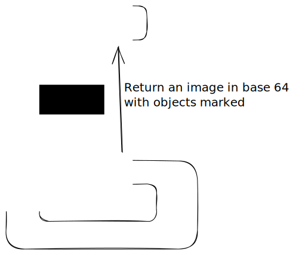

# Sample using ImageAI and FastAPI

## Description
It`s a project created for scratch to demonstrate how can we use Image AI and FastPI together. Below a simple diagram to explain:

## Project architecture

## How to run the project
* Create a virtualenv: `python -m venv virtualenv` and activate it `. virtualenv/bin/activate`.
* Install dependencies: `pip install -r requirements.txt`
* You should download the file [yolov3.pt](https://github.com/OlafenwaMoses/ImageAI/releases/download/3.0.0-pretrained/yolov3.pt) and save in the project`s root directory
* You must create the folder images_processed within api directory
* Start the api: `cd api ; uvicorn main:app --reload`